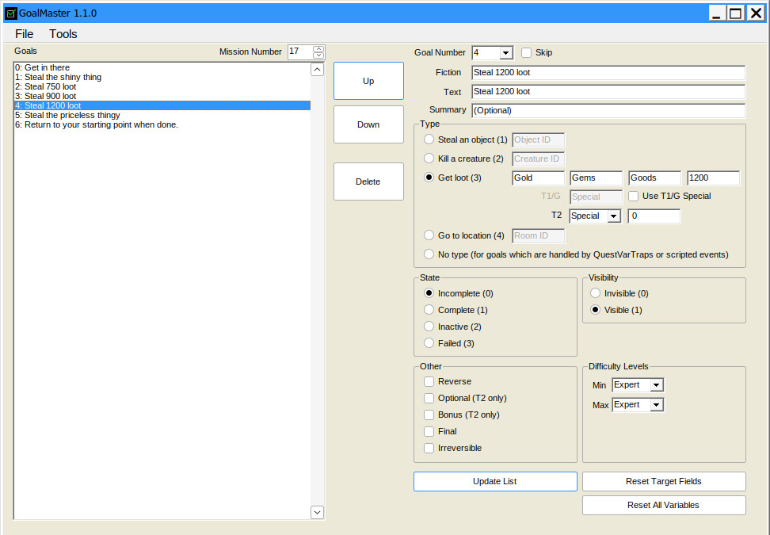
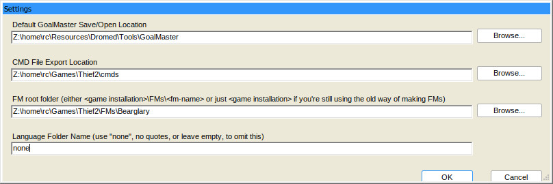
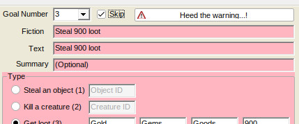
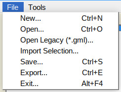

# GoalMaster
## GUI for adding/editing Goals for Thief/Thief 2 Fan Missions

### Introduction

GoalMaster blatantly rips off the user interface of **Thief Objective Wizard** (made by William the Taffer) but then it takes things further. In addition to creating goals:
* GoalMaster lets you specify the goal text, and allows goals to be re-arranged.
* Another useful feature is that you can save and load all that info so you can stop and resume work at any point.
* The program will export the "goals.str" file, and a ".cmd" file which DromEd uses to generate the goal data.
* Can import a selection of goals from another GoalMaster file.

### Installation
* Download the release package and extract the contents to a folder of your choice.
* The first time you run GoalMaster, it's recommendted you go to Tools > Settings and set the default folders for things.
  
* If you've overwritten from version 1.0, the settings file has changed. GoalMaster will look for "dirs.txt", will import what it finds into the new settings file, then rename the old file so you can see it's worth deleting (it doesn't delete the file itself in case of an error that you want to review).

### Instructions
* It's recommended that you have a reasonable idea of how to set up goals in Dromed (e.g. what sorts of commands you need to type, and how to set up goals.str) 

#### Main Interface
* For the first goal in GoalMaster set the required values, then click on Update List at the bottom.
* You'll see some info about the goal in the panel on the left.
  * The Goal List will first try to display the Summary.
  * If that's blank, or it says (Optional), it will try to display the Text.
  * If Text is blank, it will try to display the Fiction.
  * If Fiction is also blank, it will simply display 'Goal: X'.
* You can use the list on the left or the Goal Number drop-down to look at and/or edit existing goals.
  * The drop-down will always have an extra number, which is used for creating the next goal.
  * When updating the values for an existing goal, you need to click on Update List again.
* Reset Target fields resets the values of the selected Type to the default value. This can be useful if you've set a complicated loot goal with gold, gems and goods, and then change your mind and want to do something else.
* Reset All Variables does exactly that - sets all values to their defaults. This will uncheck all of the 'Other' flags, reset difficulty etc.
* The Up and Down buttons allow you to change the order of the existing goals.

##### Skip Goal

Goal skipping isn't actually supported in Thief, but this feature exists in GoalMaster in case a goal with that number has **already been set up** in DromEd, (or TOW, or another GoalMaster file)
* Admittedly it's probably better to go to the effort of re-making the goal(s) in GoalMaster, especially since you can import from other GoalMaster files.
* You can still set parameters for a skipped goal and they will be saved with the file, just not exported to .cmd or goals.str

#### File Menu

* Goal Master can save/open your goals data (including all text values).
  * The files are stored in the plain text ".json" format to make it easy for anyone wanting to write their own goal handling software.
* Open Legacy will open goals data from the previous version of this application, which was in a binary format. Saving is only possible in .json format.
* Import Selection allows the user to select any number of goals from another GoalMaster file (or the same one if you really want to...). These will be added on to the end of whatever list is currently active in the main window.
* Export is used to generate the ".cmd" file, which contains the DromEd commands for creating the goals, and "goals.str" which stores the text.

### Enjoy creating goals!
  
